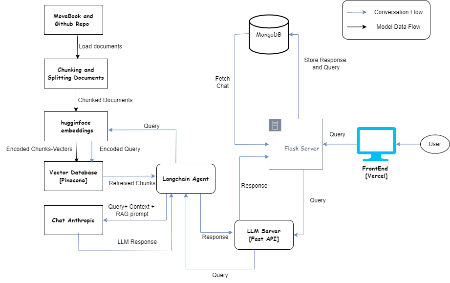

# WashingtonOrWashingTon

In the rapidly evolving landscape of AI-powered assistants and chatbots, having a solution tailored to assist in learning new programming languages has become increasingly invaluable. Although numerous AI chatbots are trained using documentation for commonly used languages, they often fall short in delivering accurate information specifically tailored to Move. Along with this, there's also a problem of going through a plethora of documentation just to look up a specific query, or going to an AI model and getting a response only to find out later that it was hallucinated or is from an older version. 

Leveraging Large Language Models (LLMs), we've developed and implemented a chatbot specifically designed to solve these two problems. By integrating insights from both the Move Notebook and the official SUI documentation, our chatbot serves as a comprehensive resource, streamlining the learning experience and eliminating the need for manual information retrieval and sifting through extensive documentation. This innovative approach offers a swift and efficient alternative, empowering users to swiftly address queries and overcome obstacles in their learning journey.

## What it does

The Move notebook and the SUI Official Documentation serve as the contextual sources from which the model retrieves responses to user inquiries concerning the Move language. Utilizing a Large Language Model (LLM) in the backend, the chatbot employs a Retrieve and Generate (RAG) mechanism to address user queries effectively.

## Technologies Used

1. langhchain 
2. huggingface
3. fastapi
4. Anthropic AI
5. ReactJs
6. Flask-restful
7. MongoDB
8. Pinecone

## General Application Architecture

* To construct our solution, we initiated by loading the *move-book* document from the website and the *SUI documentation* containing relevant information using *LangChain* built-in loaders. LangChain provides a comprehensive suite of tools for *Retrieval-Augmented Generation (RAG)* workflows, including data loaders, seamless connection to Pinecone, easy integration with Hugging Face embeddings, and LangChain agents that facilitate querying with Large Language Models (LLMs). Additionally, LangChain's RecursiveSplitters are employed for chunking, which segments the document into manageable sections.

* These sections were then encoded and converted into vectors using open-source embeddings from *Hugging Face*, enabling efficient storage within a vector database. *Pinecone*, a specialized vector database, was utilized for storing our encoded context in vector format. Pinecone offers scalable, high-performance vector search capabilities, making it ideal for managing and retrieving large sets of embeddings.

* Once the vector representation of the document was established, we utilized it as context within our system. This context served as the foundation for retrieving accurate responses to user inquiries. To achieve this, we employed *Claude from Anthropic AI* as our Large Language Model (LLM), which was tasked with fetching answers based on the provided context.

* In the operational backend of our system, *Flask* was used to manage the server-side logic. Flask is a lightweight and flexible web framework for Python that is well-suited for building web applications. For the frontend, we used React, a JavaScript library for building user interfaces. *React* enables the creation of dynamic and responsive user experiences.

* Leveraging the contextual information stored in the vector database, the LLM is dynamically invoked upon receiving each user query. This setup allows Claude to swiftly generate responses tailored to the specific needs and inquiries of the user, ensuring a seamless and informative interaction experience.

## Challenges we ran into

### Inaccurate Replies
One of the primary hurdles we faced was the occurrence of models providing inaccurate responses. Despite rigorous training and optimization efforts, ensuring precise replies remained a persistent challenge.

### Resource Limitations
Loading and running Large Language Models (LLMs) demanded substantial computational resources. Unfortunately, we faced significant challenges in this area because our infrastructure lacked the necessary capabilities to handle these demands efficiently. As college students, the high cost of GPU resources was prohibitive, preventing us from purchasing the required hardware to load and operate state-of-the-art LLMs. Consequently, we had to resort to using less resource-intensive LLMs that fit within our limited computational capacity. Additionally, long-term hosting of these models on cloud services, such as Azure, would be financially unsustainable for us due to the high expenses involved.

### Latency Issues
Certain models exhibited prolonged response times when tasked with addressing even basic queries. This latency posed a significant challenge, hindering the responsiveness and user experience of our system.

## What's next for SUI_GPT

1. This is a model that utilizes RAG architecture to retrieve information from the Move and the SUI official documentation. It lacks the proper data to truly generate code from scratch. We want to extend the SUI GPT and add a Move training data with the help of Mysten labs over which not only can *we* train our AI model but any other future community members or participants can make use of it.

2. With the ability to generate code, we wanted to make an out-of-the-box editor that would allow any person who doesn't necessarily understand blockchain to write a smart contract with just logic. This would be assisted by our web editor and an SUI Copilot that would answer general queries as well as write code. The aim would be to make use of generative AI to convert pseudo code or code logic into a working contract.

## Caveats

1. Chat-history
2. Limited Up-time
3. This RAG model can only generate information and code based on the provided documentation; it cannot produce content beyond it.
